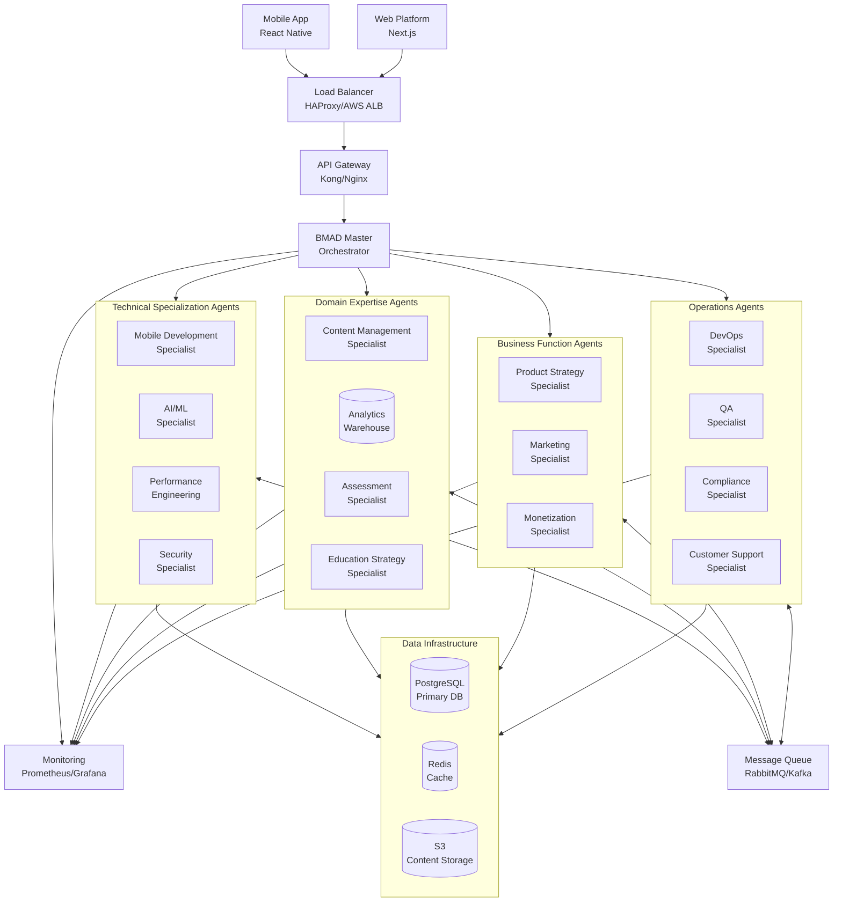

# NEETAI Agent Architecture Guide

## 🎯 Executive Summary

The NEETAI Agent Architecture is a comprehensive, modular AI system designed specifically for the Indian EdTech market, focusing on NEET preparation. This guide provides a complete overview of the 15 specialized agents that power the NEETAI platform, their interactions, and implementation strategies.

### Quick Stats
- **Total Agents**: 15 specialized agents across 4 categories
- **Market Focus**: Indian EdTech, specifically NEET preparation
- **Architecture**: Microservices-based, event-driven, scalable
- **Target Users**: 100,000+ concurrent NEET aspirants
- **Languages**: Hindi, English, and 8+ regional languages

## 📋 Table of Contents

1. [Architecture Overview](#architecture-overview)
2. [Agent Categories and Roles](#agent-categories-and-roles)
3. [Technical Infrastructure](#technical-infrastructure)
4. [Communication Protocols](#communication-protocols)
5. [Indian Market Adaptations](#indian-market-adaptations)
6. [Deployment Guide](#deployment-guide)
7. [Testing and Validation](#testing-and-validation)
8. [Monitoring and Operations](#monitoring-and-operations)
9. [Security and Compliance](#security-and-compliance)
10. [Troubleshooting Guide](#troubleshooting-guide)

## 🏗️ Architecture Overview

### Core Design Principles

**1. Modularity and Specialization**
- Each agent has a specific domain of expertise
- Clear separation of concerns
- Independent scaling and deployment
- Loose coupling between agents

**2. Educational Focus**
- Every component optimized for learning outcomes
- NEET syllabus alignment at the core
- Student success as the primary metric
- Culturally sensitive design for Indian market

**3. Scalability and Performance**
- Designed for 100K+ concurrent users
- Peak load handling during exam seasons
- Optimized for budget Android devices
- Efficient data usage for Indian connectivity

**4. Reliability and Resilience**
- 99.9% uptime target
- Graceful degradation under load
- Automated failover and recovery
- Data consistency and integrity

### System Architecture Diagram



## 🤖 Agent Categories and Roles

### Technical Specialization Agents (4 Agents)

#### 1. Mobile Development Specialist
**Primary Focus**: Cross-platform mobile app development and optimization

**Key Responsibilities**:
- React Native feature development for iOS and Android
- Mobile performance optimization for budget devices
- Offline functionality implementation
- App store compliance and deployment
- Device-specific optimizations for Indian market

**Core Capabilities**:
- Cross-platform development expertise
- Performance optimization for 2-4GB RAM devices
- Offline-first architecture implementation
- Battery and data usage optimization
- Regional device compatibility

**Success Metrics**:
- App crash rate <0.1%
- Cold start time <3 seconds
- Memory usage <150MB on budget devices
- 95% device compatibility across target market

#### 2. AI/ML Specialist
**Primary Focus**: Educational AI, personalization, and adaptive learning

**Key Responsibilities**:
- Personalized study plan generation
- Adaptive assessment and question recommendation
- Learning analytics and performance prediction
- Content recommendation engines
- Natural language processing for educational content

**Core Capabilities**:
- Machine learning model development and training
- Educational data analysis and insights
- Personalization algorithm optimization
- Predictive modeling for NEET performance
- Multi-language content processing

**Success Metrics**:
- Personalization accuracy >80%
- Content recommendation engagement >70%
- NEET score prediction correlation >0.7
- Response time <2 seconds for personalization requests

#### 3. Performance Engineering Specialist
**Primary Focus**: System scalability, optimization, and reliability

**Key Responsibilities**:
- Application performance monitoring and optimization
- Database query optimization and indexing
- Caching strategy implementation
- Load balancing and auto-scaling configuration
- Network optimization for Indian connectivity

**Core Capabilities**:
- Performance bottleneck identification and resolution
- Database optimization and scaling
- CDN configuration and optimization
- Caching layer design and implementation
- Network latency optimization

**Success Metrics**:
- API response time P95 <200ms
- Database query performance P95 <50ms
- System uptime >99.9%
- Successful handling of 100K+ concurrent users

#### 4. Security Specialist
**Primary Focus**: Data protection, privacy, and cybersecurity

**Key Responsibilities**:
- Security architecture design and implementation
- Data encryption and protection mechanisms
- Authentication and authorization systems
- Vulnerability assessment and penetration testing
- Compliance with data protection regulations

**Core Capabilities**:
- End-to-end encryption implementation
- Multi-factor authentication systems
- Role-based access control (RBAC)
- Security monitoring and threat detection
- Compliance framework implementation

**Success Metrics**:
- Zero critical security vulnerabilities
- 100% data encryption compliance
- Security incident response <1 hour
- Regulatory compliance score >95%

### Domain Expertise Agents (4 Agents)

#### 5. Content Management Specialist
**Primary Focus**: Educational content curation, quality assurance, and management

**Key Responsibilities**:
- Question bank management and validation
- Educational content quality assurance
- Content metadata and tagging systems
- Expert content review coordination
- Content localization and translation

**Core Capabilities**:
- Automated content quality assessment
- NEET syllabus alignment validation
- Multi-language content management
- Expert reviewer network coordination
- Content versioning and approval workflows

**Success Metrics**:
- Content accuracy rate >99%
- Expert approval rate >95%
- Content review cycle time <24 hours
- NEET syllabus coverage 100%

#### 6. Educational Analytics Specialist
**Primary Focus**: Learning analytics, performance tracking, and insights

**Key Responsibilities**:
- Student learning progress analysis
- Performance prediction and modeling
- Learning outcome measurement
- Cohort analysis and benchmarking
- Actionable insights generation

**Core Capabilities**:
- Advanced analytics and data modeling
- Learning pattern recognition
- Predictive performance modeling
- Statistical analysis and reporting
- Data visualization and dashboarding

**Success Metrics**:
- Prediction accuracy >80%
- Insight actionability >60%
- Analytics processing time <30 minutes
- Student engagement correlation >0.7

#### 7. Assessment and Testing Specialist
**Primary Focus**: Test creation, evaluation, and adaptive assessment

**Key Responsibilities**:
- Mock test generation and management
- Adaptive assessment algorithm development
- Scoring and evaluation systems
- Test analytics and performance insights
- Question difficulty calibration

**Core Capabilities**:
- Automated test generation
- Adaptive difficulty adjustment
- Comprehensive scoring algorithms
- Test validity and reliability analysis
- Performance analytics and reporting

**Success Metrics**:
- Test generation time <30 minutes
- Assessment reliability coefficient >0.8
- Student performance prediction accuracy >75%
- Test completion rate >90%

#### 8. Education Strategy Specialist
**Primary Focus**: Pedagogical design, learning methodologies, and curriculum alignment

**Key Responsibilities**:
- Learning path design and optimization
- Pedagogical strategy development
- Curriculum mapping and alignment
- Learning methodology research and implementation
- Educational best practices integration

**Core Capabilities**:
- Educational psychology expertise
- Curriculum design and development
- Learning methodology optimization
- Pedagogical research and analysis
- Educational standards compliance

**Success Metrics**:
- Learning path completion rate >80%
- Student satisfaction with learning methods >90%
- Curriculum alignment score 100%
- Learning outcome improvement >25%

### Business Function Agents (3 Agents)

#### 9. Product Strategy Specialist
**Primary Focus**: Product roadmap, feature prioritization, and market strategy

**Key Responsibilities**:
- Product roadmap planning and management
- Feature prioritization and requirement analysis
- Market research and competitive analysis
- User research and persona development
- Business metrics and KPI tracking

**Core Capabilities**:
- Market analysis and trend identification
- Feature impact assessment
- User research and feedback analysis
- Competitive intelligence gathering
- Strategic planning and execution

**Success Metrics**:
- Feature adoption rate >70%
- User satisfaction score >4.5/5
- Market share growth >15% annually
- Product-market fit score >8/10

#### 10. Marketing Specialist
**Primary Focus**: User acquisition, engagement, and brand building

**Key Responsibilities**:
- Digital marketing campaign management
- User acquisition strategy and execution
- Content marketing and social media management
- Community building and engagement
- Brand positioning and messaging

**Core Capabilities**:
- Multi-channel marketing expertise
- Growth hacking and optimization
- Content creation and management
- Social media strategy and execution
- Performance marketing and analytics

**Success Metrics**:
- User acquisition cost <₹500
- Customer acquisition conversion >3%
- Brand awareness growth >30% annually
- Marketing ROI >300%

#### 11. Monetization Specialist
**Primary Focus**: Revenue optimization, pricing strategy, and business model innovation

**Key Responsibilities**:
- Pricing strategy development and optimization
- Revenue model innovation and testing
- Subscription management and optimization
- Payment integration and optimization
- Revenue analytics and forecasting

**Core Capabilities**:
- Pricing psychology and optimization
- Revenue model design and testing
- Payment gateway integration
- Financial modeling and analysis
- Revenue optimization strategies

**Success Metrics**:
- Revenue per user increase >20% annually
- Payment success rate >95%
- Churn rate <5% monthly
- Lifetime value to acquisition cost ratio >3:1

### Operations Agents (4 Agents)

#### 12. DevOps Infrastructure Specialist
**Primary Focus**: Infrastructure automation, deployment, and operational excellence

**Key Responsibilities**:
- CI/CD pipeline design and management
- Infrastructure automation and scaling
- System monitoring and alerting
- Deployment strategy and execution
- Disaster recovery and business continuity

**Core Capabilities**:
- Infrastructure as Code (IaC)
- Container orchestration (Kubernetes)
- Automated deployment pipelines
- System monitoring and observability
- Cloud infrastructure management

**Success Metrics**:
- Deployment success rate >95%
- Mean time to recovery <30 minutes
- Infrastructure cost per user <₹5/month
- System uptime >99.9%

#### 13. QA Testing and Quality Assurance Specialist
**Primary Focus**: Quality assurance, testing automation, and defect prevention

**Key Responsibilities**:
- Test strategy design and execution
- Automated testing framework development
- Quality metrics tracking and reporting
- Defect management and resolution
- Test environment management

**Core Capabilities**:
- Comprehensive testing strategy design
- Test automation framework development
- Quality metrics analysis and reporting
- Defect lifecycle management
- Cross-platform testing expertise

**Success Metrics**:
- Defect escape rate <5%
- Test automation coverage >70%
- Bug resolution time <24 hours
- Customer satisfaction >90%

#### 14. Compliance and Legal Specialist
**Primary Focus**: Regulatory compliance, data protection, and legal risk management

**Key Responsibilities**:
- Data protection and privacy compliance
- Educational regulation adherence
- Legal documentation and policy management
- Regulatory change monitoring and adaptation
- Risk assessment and mitigation

**Core Capabilities**:
- GDPR and Indian data protection expertise
- Educational compliance knowledge
- Legal risk assessment and management
- Policy development and implementation
- Regulatory monitoring and adaptation

**Success Metrics**:
- Compliance score >95%
- Zero regulatory violations
- Data breach response time <72 hours
- Legal risk mitigation >90%

#### 15. Customer Support and Success Specialist
**Primary Focus**: User support, success enablement, and satisfaction optimization

**Key Responsibilities**:
- Multi-channel customer support management
- User success program development and execution
- Support quality assurance and optimization
- Customer feedback analysis and action
- Support team training and development

**Core Capabilities**:
- Omnichannel support strategy
- Customer success methodology
- Support quality management
- Feedback analysis and action planning
- Team training and development

**Success Metrics**:
- Customer satisfaction score >90%
- First contact resolution >70%
- Support response time <30 seconds
- Customer retention rate >90%

## 🔧 Technical Infrastructure

### Architecture Stack

**Frontend Applications**:
- **Mobile App**: React Native for iOS and Android
- **Web Platform**: Next.js with TypeScript
- **Admin Dashboard**: React with Material-UI

**Backend Services**:
- **API Gateway**: Kong or Nginx for request routing
- **Microservices**: Node.js/Python services for each agent
- **Message Queue**: RabbitMQ or Apache Kafka for async communication
- **Load Balancer**: HAProxy or AWS Application Load Balancer

**Data Infrastructure**:
- **Primary Database**: PostgreSQL with read replicas
- **Cache Layer**: Redis for session management and caching
- **Content Storage**: AWS S3 or Google Cloud Storage
- **Analytics Warehouse**: BigQuery or Snowflake
- **Search Engine**: Elasticsearch for content search

**DevOps and Infrastructure**:
- **Container Platform**: Docker with Kubernetes orchestration
- **CI/CD Pipeline**: Jenkins or GitHub Actions
- **Infrastructure as Code**: Terraform
- **Monitoring**: Prometheus, Grafana, and Jaeger
- **Log Management**: ELK Stack (Elasticsearch, Logstash, Kibana)

### Deployment Architecture

**Multi-Cloud Strategy**:
- **Primary Cloud**: AWS (Mumbai region - ap-south-1)
- **Secondary Cloud**: Google Cloud Platform (asia-south1)
- **CDN**: CloudFlare with Indian edge locations
- **Disaster Recovery**: Cross-cloud backup and failover

**Environment Strategy**:
- **Production**: Multi-AZ deployment with auto-scaling
- **Staging**: Production-like environment for testing
- **Development**: Isolated development environments
- **QA**: Dedicated testing environment with test data

**Scaling Strategy**:
- **Horizontal Scaling**: Auto-scaling based on CPU/memory usage
- **Database Scaling**: Read replicas and connection pooling
- **CDN Optimization**: Aggressive caching for static content
- **Load Balancing**: Geographic and performance-based routing

## 📡 Communication Protocols

### Message Format Standard

All inter-agent communication follows a standardized JSON message format:

```json
{
  "schema_version": "1.0",
  "message_id": "uuid",
  "timestamp": "2024-01-01T00:00:00Z",
  "source_agent": "agent_identifier",
  "target_agent": "agent_identifier",
  "message_type": "request|response|event|broadcast",
  "priority": "critical|high|medium|low",
  "correlation_id": "uuid",
  "payload": {},
  "metadata": {
    "retry_count": 0,
    "timeout": 30,
    "encryption": true
  }
}
```

### Communication Patterns

**1. Request-Response Pattern**:
- Synchronous communication for immediate responses
- Used for real-time operations like authentication
- Timeout mechanisms and retry policies
- Circuit breaker patterns for resilience

**2. Event-Driven Pattern**:
- Asynchronous communication via message queues
- Used for workflow orchestration and data updates
- Event topics for different categories of events
- At-least-once delivery guarantee

**3. Workflow Orchestration**:
- BMAD Master Agent coordinates complex workflows
- Step-by-step execution with dependency management
- Error handling and rollback capabilities
- Progress tracking and monitoring

### Security and Authentication

**Transport Security**:
- TLS 1.3 for all communications
- Certificate-based mutual authentication
- Message-level encryption for sensitive data

**Access Control**:
- Role-based access control (RBAC)
- JWT tokens for authentication
- API rate limiting and throttling
- Audit logging for all communications

## 🇮🇳 Indian Market Adaptations

### Device and Network Optimizations

**Budget Device Support**:
- App size optimization (<50MB)
- Memory usage optimization (<150MB)
- CPU usage optimization for low-end processors
- Battery usage minimization

**Network Connectivity**:
- 2G/3G network optimization
- Aggressive offline functionality
- Data compression and optimization
- Smart sync and download strategies

**Performance Targets**:
- Cold app start: <3 seconds
- Warm app start: <1 second
- API response time: <200ms P95
- Content loading: <2 seconds on 3G

### Localization and Cultural Adaptation

**Language Support**:
- **Primary**: Hindi and English
- **Regional**: Tamil, Telugu, Kannada, Malayalam, Gujarati, Marathi, Bengali, Punjabi
- **Hinglish**: Code-switching support for urban users

**Cultural Considerations**:
- Family-centric decision making
- Respect for teacher authority
- Competitive learning environment
- Festival and exam calendar integration

**Content Localization**:
- Curriculum mapping for different state boards
- Region-specific examples and case studies
- Cultural sensitivity in content and design
- Local success stories and role models

### Payment and Monetization

**Payment Methods**:
- **UPI**: Google Pay, PhonePe, Paytm integration
- **Mobile Wallets**: Paytm, Amazon Pay, MobiKwik
- **Traditional**: Net banking, credit/debit cards
- **Cash**: Offline payment collection partnerships

**Pricing Strategy**:
- Freemium model for user acquisition
- Affordable premium tiers (₹99-₹999/month)
- Family plans with multiple child discounts
- Scholarship programs for meritorious students

**Regional Pricing**:
- Tier-based pricing (Tier 1, 2, 3 cities)
- Special offers during exam seasons
- Student discount programs
- Referral incentives

## 🚀 Deployment Guide

### Prerequisites

**Infrastructure Requirements**:
- Kubernetes cluster (minimum 3 nodes)
- PostgreSQL database (primary + read replicas)
- Redis cache cluster
- Message queue service (RabbitMQ/Kafka)
- Container registry (Docker Hub/AWS ECR)

**Development Tools**:
- Docker and Docker Compose
- kubectl for Kubernetes management
- Helm for package management
- Terraform for infrastructure provisioning

### Step-by-Step Deployment

#### 1. Infrastructure Setup

```bash
# Clone the repository
git clone https://github.com/your-org/neetai-agents.git
cd neetai-agents

# Set up infrastructure with Terraform
cd infrastructure/terraform
terraform init
terraform plan -var-file="production.tfvars"
terraform apply

# Configure Kubernetes cluster
kubectl create namespace neetai-agents
kubectl config set-context --current --namespace=neetai-agents
```

#### 2. Database Setup

```bash
# Create databases
kubectl apply -f infrastructure/k8s/postgres-cluster.yaml

# Run database migrations
kubectl apply -f infrastructure/k8s/db-migrations.yaml

# Verify database connectivity
kubectl exec -it postgres-primary-0 -- psql -U neetai -d neetai_production
```

#### 3. Configuration Management

```bash
# Create configuration secrets
kubectl create secret generic neetai-secrets \
  --from-literal=db-password=$DB_PASSWORD \
  --from-literal=redis-password=$REDIS_PASSWORD \
  --from-literal=jwt-secret=$JWT_SECRET

# Apply configuration maps
kubectl apply -f config/configmaps/
```

#### 4. Agent Deployment

```bash
# Deploy infrastructure components
kubectl apply -f deployments/infrastructure/

# Deploy agents in dependency order
kubectl apply -f deployments/agents/technical/
kubectl apply -f deployments/agents/domain/
kubectl apply -f deployments/agents/business/
kubectl apply -f deployments/agents/operations/

# Deploy orchestration layer
kubectl apply -f deployments/orchestration/
```

#### 5. Verification and Testing

```bash
# Check deployment status
kubectl get pods -l app=neetai-agents

# Run health checks
kubectl apply -f testing/health-checks.yaml

# Execute smoke tests
kubectl apply -f testing/smoke-tests.yaml

# Monitor logs
kubectl logs -f deployment/bmad-master-agent
```

### Environment-Specific Configurations

#### Production Environment

```yaml
# production.yaml
environment: production
replicas:
  mobile_dev_agent: 3
  ai_ml_agent: 5
  content_mgmt_agent: 3
  analytics_agent: 3

resources:
  requests:
    cpu: 500m
    memory: 1Gi
  limits:
    cpu: 2000m
    memory: 4Gi

autoscaling:
  enabled: true
  minReplicas: 2
  maxReplicas: 10
  targetCPUUtilization: 70
```

#### Staging Environment

```yaml
# staging.yaml
environment: staging
replicas:
  mobile_dev_agent: 1
  ai_ml_agent: 2
  content_mgmt_agent: 1
  analytics_agent: 1

resources:
  requests:
    cpu: 250m
    memory: 512Mi
  limits:
    cpu: 1000m
    memory: 2Gi

autoscaling:
  enabled: true
  minReplicas: 1
  maxReplicas: 3
  targetCPUUtilization: 80
```

### Monitoring and Observability Setup

```bash
# Deploy monitoring stack
helm repo add prometheus-community https://prometheus-community.github.io/helm-charts
helm install prometheus prometheus-community/kube-prometheus-stack

# Configure Grafana dashboards
kubectl apply -f monitoring/grafana-dashboards.yaml

# Set up alerting rules
kubectl apply -f monitoring/alert-rules.yaml

# Deploy log aggregation
helm install elasticsearch elastic/elasticsearch
helm install kibana elastic/kibana
```

## 🧪 Testing and Validation

### Testing Strategy Overview

**Testing Pyramid**:
- **Unit Tests (70%)**: Individual agent function testing
- **Integration Tests (20%)**: Agent-to-agent communication
- **End-to-End Tests (10%)**: Complete user workflows

**Testing Categories**:
- Functional testing for all agent capabilities
- Performance testing under load conditions
- Security testing for data protection
- Educational effectiveness testing
- Cultural adaptation and localization testing

### Running Tests

#### Unit Tests

```bash
# Run all unit tests
npm run test:unit

# Run tests for specific agent
npm run test:unit -- --grep "mobile-development-specialist"

# Generate coverage reports
npm run test:coverage
```

#### Integration Tests

```bash
# Run integration test suite
npm run test:integration

# Test specific workflow
npm run test:integration -- --workflow student-onboarding

# Test agent communication
npm run test:integration -- --suite communication
```

#### Performance Tests

```bash
# Load testing
npm run test:load -- --users 10000 --duration 30m

# Stress testing
npm run test:stress -- --scenario peak-exam-season

# Monitor performance metrics
kubectl port-forward svc/grafana 3000:80
```

### Quality Gates

**Code Quality Requirements**:
- Unit test coverage >70%
- No critical security vulnerabilities
- Code complexity within acceptable limits
- All linting rules passing

**Integration Quality Requirements**:
- All integration tests passing
- Workflow completion within SLA
- Agent communication reliability >99%

**Production Readiness Requirements**:
- Performance benchmarks met
- Security compliance validated
- Educational effectiveness confirmed

## 📊 Monitoring and Operations

### Monitoring Stack

**Infrastructure Monitoring**:
- **Prometheus**: Metrics collection and storage
- **Grafana**: Visualization and dashboarding
- **AlertManager**: Alert routing and management
- **Jaeger**: Distributed tracing

**Application Monitoring**:
- **APM Tools**: New Relic or Datadog for application performance
- **Log Management**: ELK Stack for centralized logging
- **Error Tracking**: Sentry for error monitoring
- **Uptime Monitoring**: Pingdom or StatusPage

### Key Metrics and Alerts

#### Infrastructure Metrics

```yaml
# Prometheus alert rules
groups:
  - name: infrastructure
    rules:
      - alert: HighCPUUsage
        expr: cpu_usage_percent > 80
        for: 5m
        labels:
          severity: warning
        annotations:
          summary: "High CPU usage detected"

      - alert: HighMemoryUsage
        expr: memory_usage_percent > 85
        for: 5m
        labels:
          severity: warning

      - alert: DatabaseConnections
        expr: postgres_connections > 100
        for: 2m
        labels:
          severity: critical
```

#### Application Metrics

```yaml
# Application-specific alerts
  - name: agents
    rules:
      - alert: AgentResponseTime
        expr: agent_response_time_p95 > 2000
        for: 2m
        labels:
          severity: warning

      - alert: MessageQueueBacklog
        expr: message_queue_depth > 1000
        for: 5m
        labels:
          severity: critical

      - alert: EducationalEffectiveness
        expr: learning_outcome_score < 0.7
        for: 15m
        labels:
          severity: warning
```

### Operational Procedures

#### Incident Response

**Severity Levels**:
- **Critical**: System down, data loss, security breach
- **High**: Major feature failure, performance degradation
- **Medium**: Minor feature issues, documentation errors
- **Low**: Enhancement requests, cosmetic issues

**Response Process**:
1. **Detection**: Automated monitoring alerts
2. **Triage**: Assess impact and assign severity
3. **Response**: Execute runbook procedures
4. **Communication**: Update status page and stakeholders
5. **Resolution**: Fix issue and verify recovery
6. **Post-mortem**: Document lessons learned

#### Maintenance Procedures

**Regular Maintenance Tasks**:
- Database backup verification (daily)
- Log rotation and cleanup (weekly)
- Security patches and updates (monthly)
- Performance optimization review (monthly)
- Disaster recovery testing (quarterly)

**Scheduled Maintenance Windows**:
- **Primary**: Sundays 2:00-4:00 AM IST
- **Emergency**: 24/7 with customer notification
- **Major Upgrades**: During low-usage periods

### Performance Optimization

**Database Optimization**:
- Query performance monitoring
- Index optimization and maintenance
- Connection pool tuning
- Automated vacuum and analyze

**Application Optimization**:
- Code profiling and optimization
- Memory leak detection and fixing
- Cache hit rate optimization
- API response time optimization

**Infrastructure Optimization**:
- Auto-scaling configuration tuning
- Load balancer optimization
- CDN cache hit rate improvement
- Network latency reduction

## 🔒 Security and Compliance

### Security Framework

**Data Protection**:
- End-to-end encryption for all data in transit
- AES-256 encryption for data at rest
- Regular key rotation and management
- Secure backup and recovery procedures

**Access Control**:
- Multi-factor authentication (MFA)
- Role-based access control (RBAC)
- Principle of least privilege
- Regular access audits and reviews

**Network Security**:
- VPC with private subnets
- Security groups and network ACLs
- Web Application Firewall (WAF)
- DDoS protection and mitigation

### Compliance Requirements

**Indian Regulations**:
- Personal Data Protection Bill compliance
- Information Technology Act 2000
- Right to Information Act
- Consumer Protection Act

**International Standards**:
- GDPR compliance for international users
- ISO 27001 security management
- WCAG 2.1 AA accessibility compliance
- PCI DSS for payment processing

**Educational Compliance**:
- Student data privacy protection
- FERPA compliance (for international students)
- COPPA compliance (for users under 13)
- Educational content accuracy standards

### Security Procedures

**Vulnerability Management**:
- Regular security scanning and assessment
- Penetration testing (quarterly)
- Security code reviews
- Dependency vulnerability monitoring

**Incident Response**:
- 24/7 security monitoring
- Automated threat detection
- Incident response playbooks
- Breach notification procedures

**Audit and Compliance**:
- Regular compliance audits
- Security metrics and reporting
- Third-party security assessments
- Continuous compliance monitoring

## 🔧 Troubleshooting Guide

### Common Issues and Solutions

#### Agent Communication Issues

**Problem**: Agents not responding to messages
**Symptoms**: Timeout errors, workflow failures
**Diagnosis**: Check message queue health, network connectivity
**Solution**:
```bash
# Check message queue status
kubectl get pods -l app=rabbitmq
kubectl logs -f deployment/rabbitmq

# Restart message queue if needed
kubectl rollout restart deployment/rabbitmq

# Verify agent connectivity
kubectl exec -it agent-pod -- curl http://target-agent:8080/health
```

#### Performance Degradation

**Problem**: Slow response times, high latency
**Symptoms**: API responses >2 seconds, user complaints
**Diagnosis**: Check system metrics, database performance
**Solution**:
```bash
# Check system metrics
kubectl top pods
kubectl top nodes

# Check database performance
kubectl exec -it postgres-primary-0 -- pg_stat_activity

# Scale up if needed
kubectl scale deployment ai-ml-agent --replicas=5
```

#### Database Connection Issues

**Problem**: Database connection failures
**Symptoms**: Connection timeout errors, application crashes
**Diagnosis**: Check connection pool, database health
**Solution**:
```bash
# Check database status
kubectl get pods -l app=postgresql

# Check connection pool status
kubectl logs -f deployment/pgbouncer

# Restart database connections
kubectl rollout restart deployment/pgbouncer
```

### Diagnostic Commands

**System Health Check**:
```bash
# Overall system status
kubectl get pods --all-namespaces
kubectl get services
kubectl get ingress

# Check resource usage
kubectl top pods --sort-by=memory
kubectl describe nodes

# Check persistent volumes
kubectl get pv,pvc
```

**Application Debugging**:
```bash
# Check application logs
kubectl logs -f deployment/agent-name --tail=100

# Debug networking issues
kubectl exec -it agent-pod -- nslookup target-service
kubectl exec -it agent-pod -- ping target-service

# Check configuration
kubectl get configmap agent-config -o yaml
kubectl get secret agent-secrets -o yaml
```

**Performance Analysis**:
```bash
# Check metrics
kubectl port-forward svc/prometheus 9090:9090
kubectl port-forward svc/grafana 3000:80

# Analyze traces
kubectl port-forward svc/jaeger 16686:16686

# Check logs
kubectl port-forward svc/kibana 5601:5601
```

### Recovery Procedures

#### Service Recovery

**Steps for service restoration**:
1. Identify the affected service
2. Check service logs for error patterns
3. Verify configuration and secrets
4. Restart the service if necessary
5. Monitor service health and performance
6. Scale up if performance issues persist

#### Data Recovery

**Database Recovery Process**:
1. Stop write operations to prevent data corruption
2. Assess the extent of data loss or corruption
3. Restore from the most recent backup
4. Apply transaction logs since backup
5. Verify data integrity and consistency
6. Resume normal operations

#### Disaster Recovery

**Full System Recovery**:
1. Activate disaster recovery site
2. Restore all services from backups
3. Update DNS to point to recovery site
4. Verify all services are operational
5. Communicate status to users
6. Plan for failback to primary site

### Contact Information

**Emergency Contacts**:
- **On-Call Engineer**: +91-XXXX-XXXX-XX
- **DevOps Team Lead**: devops-lead@neetai.com
- **Security Team**: security@neetai.com
- **Management Escalation**: cto@neetai.com

**Support Channels**:
- **Slack**: #neetai-alerts
- **PagerDuty**: Critical alerts
- **Email**: alerts@neetai.com
- **Phone**: Emergency escalation only

## 📈 Success Metrics and KPIs

### Technical Performance Metrics

**System Reliability**:
- Uptime: 99.9% target
- Mean Time to Recovery (MTTR): <30 minutes
- Mean Time Between Failures (MTBF): >720 hours
- Deployment Success Rate: >95%

**Performance Metrics**:
- API Response Time (P95): <200ms
- Database Query Performance (P95): <50ms
- Mobile App Cold Start: <3 seconds
- Page Load Time on 3G: <3 seconds

**Scalability Metrics**:
- Concurrent User Capacity: 100,000+
- Peak Load Handling: 200,000+ during exam seasons
- Auto-scaling Response Time: <2 minutes
- Resource Utilization Efficiency: >70%

### Educational Effectiveness Metrics

**Learning Outcomes**:
- Student Performance Improvement: >25%
- Content Accuracy Rate: >99%
- NEET Score Prediction Accuracy: >80%
- Learning Path Completion Rate: >80%

**Student Engagement**:
- Daily Active Users: Target 50% of registered users
- Session Duration: >45 minutes average
- Content Completion Rate: >70%
- Practice Test Completion Rate: >90%

**Platform Effectiveness**:
- Student Satisfaction Score: >4.5/5
- Parent Satisfaction Score: >4.3/5
- Teacher Endorsement Rate: >85%
- NEET Success Rate Correlation: Positive correlation

### Business Success Metrics

**User Growth**:
- Monthly Active Users Growth: >20%
- User Acquisition Cost: <₹500
- Customer Acquisition Rate: >3% conversion
- Geographic Expansion: 5+ states annually

**Revenue Performance**:
- Revenue Per User: >₹100/month
- Customer Lifetime Value: >₹2,000
- Monthly Recurring Revenue Growth: >25%
- Payment Success Rate: >95%

**Market Position**:
- Brand Awareness: >30% in target demographics
- Market Share: Top 3 in NEET preparation segment
- Competitive Differentiation: Unique value proposition
- Customer Retention: >90% annual retention

### Operational Excellence Metrics

**Development Velocity**:
- Feature Development Cycle Time: <2 weeks
- Code Deployment Frequency: Daily
- Bug Fix Response Time: <24 hours
- Security Patch Deployment: <24 hours

**Support Excellence**:
- Customer Support Response Time: <30 seconds
- First Contact Resolution Rate: >70%
- Customer Satisfaction Score: >90%
- Support Ticket Volume: <5% of user base

**Compliance and Security**:
- Security Incident Response Time: <1 hour
- Compliance Score: >95%
- Data Breach Incidents: Zero tolerance
- Privacy Violation Reports: Zero tolerance

## 🎓 Conclusion

The NEETAI Agent Architecture represents a comprehensive, scalable, and culturally-adapted solution for the Indian EdTech market. With 15 specialized agents working in harmony, the system is designed to deliver exceptional educational outcomes while maintaining the highest standards of performance, security, and reliability.

### Key Success Factors

1. **Educational Focus**: Every component optimized for learning outcomes
2. **Cultural Sensitivity**: Deep adaptation to Indian market needs
3. **Scalable Architecture**: Built to handle millions of concurrent users
4. **Operational Excellence**: Comprehensive monitoring and automation
5. **Continuous Innovation**: AI-driven personalization and optimization

### Next Steps

1. **Phase 1**: Deploy core agents and basic functionality
2. **Phase 2**: Add advanced AI features and regional language support
3. **Phase 3**: Expand to additional competitive exams (JEE, UPSC)
4. **Phase 4**: International expansion with localization

### Support and Community

- **Documentation**: [docs.neetai.com](https://docs.neetai.com)
- **Community**: [community.neetai.com](https://community.neetai.com)
- **Support**: [support@neetai.com](mailto:support@neetai.com)
- **GitHub**: [github.com/neetai/agents](https://github.com/neetai/agents)

---

**Remember**: This architecture is not just about technology—it's about empowering the next generation of doctors in India. Every line of code, every optimization, and every feature should serve the ultimate goal of helping NEET aspirants achieve their dreams of medical education.

*"Excellence in education technology, engineered for India, optimized for success."*