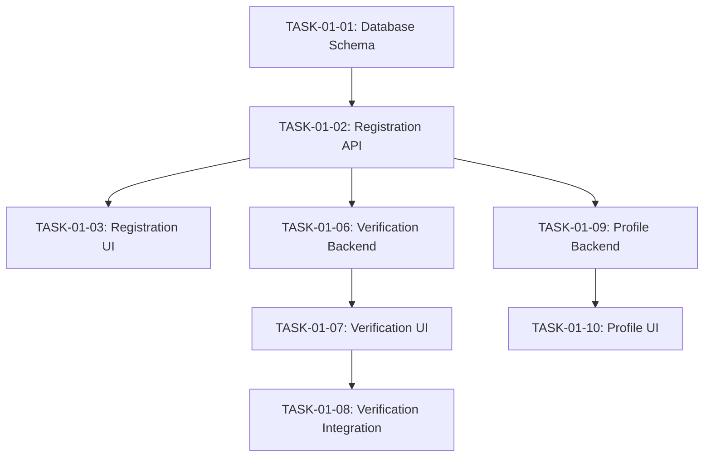
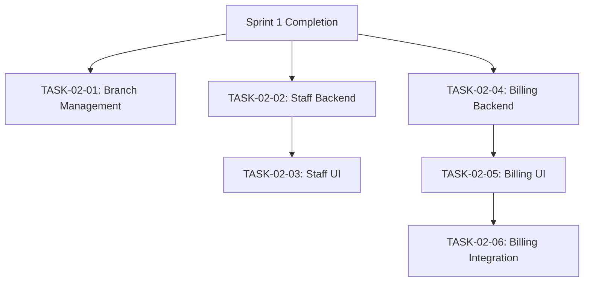

# BMAD Task-Story Traceability Matrix
## NEET AI Coach App - Complete Alignment

**Created**: 2024-01-20
**Version**: 2.0
**Methodology**: BMAD (Behavior-driven, Modular, Agile, Documentation)

---

## 📊 **Complete Task-Story Mapping**

### **EPIC-01: Institute Onboarding & Management System**

| Story ID | Story Title | Tasks Required | Status | Sprint |
|----------|------------|----------------|--------|--------|
| STORY-01-01 | Institute Registration | ✅ TASK-01-01, TASK-01-02, TASK-01-03 | Complete | Sprint 1 |
| STORY-01-02 | Institute Verification | ❌ TASK-01-06, TASK-01-07, TASK-01-08 | Missing | Sprint 1 |
| STORY-01-03 | Institute Profile Management | ❌ TASK-01-09, TASK-01-10 | Missing | Sprint 1 |
| STORY-01-04 | Branch & Location Management | ✅ TASK-02-01 | Complete | Sprint 2 |
| STORY-01-05 | Staff & Role Management | ❌ TASK-02-02, TASK-02-03 | Missing | Sprint 2 |
| STORY-01-06 | Subscription & Billing | ❌ TASK-02-04, TASK-02-05, TASK-02-06 | Missing | Sprint 2 |

**Epic 01 Completion**: 4/15 tasks (27%)

---

### **EPIC-02: Teacher & Coach Management System**

| Story ID | Story Title | Tasks Required | Status | Sprint |
|----------|------------|----------------|--------|--------|
| STORY-02-01 | Teacher Onboarding & Profile | ✅ TASK-03-01, TASK-03-02 | Complete | Sprint 3 |
| STORY-02-02 | Teacher Profile Management | ❌ TASK-04-01, TASK-04-02, TASK-04-03 | Missing | Sprint 4 |

**Epic 02 Completion**: 2/5 tasks (40%)

---

### **EPIC-03: Batch & Student Management System**

| Story ID | Story Title | Tasks Required | Status | Sprint |
|----------|------------|----------------|--------|--------|
| STORY-03-01 | Batch Creation & Management | ✅ TASK-05-01 (Backend Only) | Partial | Sprint 5 |
| STORY-03-02 | Student Profile & Progress | ❌ TASK-05-02, TASK-05-03, TASK-05-04 | Missing | Sprint 5 |

**Epic 03 Completion**: 1/4 tasks (25%)

---

### **EPIC-04: Performance Tracking & Analytics**

| Story ID | Story Title | Tasks Required | Status | Sprint |
|----------|------------|----------------|--------|--------|
| STORY-04-01 | Real-time Analytics Dashboard | ✅ TASK-06-01 (Frontend Only) | Partial | Sprint 6 |
|  |  | ❌ TASK-06-02 (Backend Pipeline) | Missing | Sprint 6 |

**Epic 04 Completion**: 1/2 tasks (50%)

---

### **EPIC-05: Communication & Collaboration**

| Story ID | Story Title | Tasks Required | Status | Sprint |
|----------|------------|----------------|--------|--------|
| STORY-05-01 | Parent-Teacher Communication | ❌ TASK-06-03, TASK-06-04, TASK-06-05 | Missing | Sprint 6 |

**Epic 05 Completion**: 0/3 tasks (0%)

---

### **EPIC-06: White-label Customization & Branding**

| Story ID | Story Title | Tasks Required | Status | Sprint |
|----------|------------|----------------|--------|--------|
| STORY-06-01 | Brand Customization System | ❌ TASK-07-01, TASK-07-02, TASK-07-03 | Missing | Sprint 7 |

**Epic 06 Completion**: 0/3 tasks (0%)

---

## 📈 **Overall BMAD Compliance Status**

### **Summary Statistics**
- **Total Stories**: 13
- **Total Required Tasks**: 32
- **Tasks Created**: 10
- **Tasks Missing**: 22
- **Current Completion**: 31.25%

### **Sprint-wise Task Distribution**

| Sprint | Stories | Required Tasks | Created Tasks | Missing Tasks | Completion % |
|--------|---------|----------------|---------------|---------------|--------------|
| Sprint 1 | 3 | 8 | 3 | 5 | 37.5% |
| Sprint 2 | 3 | 6 | 1 | 5 | 16.7% |
| Sprint 3 | 1 | 2 | 2 | 0 | 100% |
| Sprint 4 | 1 | 3 | 0 | 3 | 0% |
| Sprint 5 | 2 | 4 | 1 | 3 | 25% |
| Sprint 6 | 3 | 6 | 1 | 5 | 16.7% |
| Sprint 7 | 1 | 3 | 0 | 3 | 0% |

---

## 🎯 **Detailed Task Breakdown by BMAD Phases**

### **Backend Phase Tasks**
```
✅ TASK-01-01: Database Schema Design (Complete)
✅ TASK-01-02: API Endpoints Registration (Complete)  
✅ TASK-03-01: Teacher Database Schema & Implementation (Complete)
✅ TASK-05-01: Batch Management Backend (Complete)

❌ TASK-01-06: Institute Verification Backend
❌ TASK-01-09: Institute Profile Management Backend
❌ TASK-02-02: Staff & Role Management Backend
❌ TASK-02-04: Subscription & Billing Backend
❌ TASK-04-01: Teacher Profile Management Backend
❌ TASK-05-02: Student Profile Management Backend
❌ TASK-06-02: Analytics Data Pipeline Backend
❌ TASK-06-03: Communication System Backend
❌ TASK-07-01: Brand Customization Backend
```

### **Frontend Phase Tasks**
```
✅ TASK-01-03: Registration Form Components (Complete)
✅ TASK-03-02: Teacher Onboarding UI Components (Complete)
✅ TASK-06-01: Real-time Analytics Dashboard UI (Complete)

❌ TASK-01-07: Institute Verification UI Components
❌ TASK-01-10: Institute Profile Management UI
❌ TASK-02-03: Staff & Role Management UI
❌ TASK-02-05: Subscription & Billing UI
❌ TASK-04-02: Teacher Profile Management UI
❌ TASK-05-03: Student Profile Management UI
❌ TASK-06-04: Communication Platform UI
❌ TASK-07-02: Brand Customization UI
```

### **Integration Phase Tasks**
```
✅ TASK-01-04: Admin Verification System (Complete)
✅ TASK-01-05: Integration Testing Framework (Complete)

❌ TASK-01-08: Institute Verification Integration & Testing
❌ TASK-02-06: Subscription Billing Integration & Testing
❌ TASK-04-03: Teacher Performance Tracking Integration
❌ TASK-05-04: Student Progress Tracking Integration
❌ TASK-06-05: Communication Integration & Testing
❌ TASK-07-03: White-label Theme Integration & Testing
```

---

## 🔄 **Critical Path Dependencies**

### **Sprint 1 Dependencies**


### **Sprint 2 Dependencies**


### **Cross-Epic Dependencies**
- Epic 02 (Teachers) depends on Epic 01 (Institute) completion
- Epic 03 (Students) depends on Epic 02 (Teachers) completion
- Epic 04 (Analytics) depends on Epic 03 (Students) data
- Epic 05 (Communication) integrates with all user management epics
- Epic 06 (White-label) customizes all user-facing components

---

## 📋 **Acceptance Criteria Mapping**

### **Story AC to Task Deliverable Mapping**
Each story's acceptance criteria must map to specific task deliverables:

**Example: STORY-01-02 (Institute Verification)**
- AC-01: Admin Review Dashboard → TASK-01-06 (Backend) + TASK-01-07 (Frontend)
- AC-02: Document Validation → TASK-01-06 (Backend validation logic)
- AC-03: Email Notifications → TASK-01-06 (Email service integration)
- AC-04: Status Tracking → TASK-01-07 (UI status components)
- AC-05: Audit Trail → TASK-01-08 (Integration testing & audit logging)

---

## ✅ **BMAD Methodology Compliance Checklist**

### **B - Behavior-driven Development**
- [x] All stories follow "As a [role], I want [goal], so that [benefit]" format
- [x] Acceptance criteria are testable and measurable
- [ ] All tasks include behavior validation tests
- [ ] Task deliverables map to specific user behaviors

### **M - Modular Architecture**
- [x] Stories are properly decomposed into logical modules
- [ ] Tasks are appropriately sized (1-3 days each)
- [ ] Clear separation of concerns between backend/frontend/integration
- [ ] Reusable components identified and documented

### **A - Agile Development**
- [x] Sprint-based organization with clear goals
- [ ] All sprints have complete task backlogs
- [ ] Dependencies clearly identified and managed
- [ ] Regular feedback cycles built into each sprint

### **D - Documentation-driven**
- [x] Comprehensive story documentation exists
- [ ] All tasks have detailed technical specifications
- [ ] API documentation for all endpoints
- [ ] Component library documentation

---

## 🚀 **Implementation Priority**

### **Phase 1: Critical Path Completion (Weeks 1-2)**
1. Complete Sprint 1 missing tasks (Institute Verification & Profile)
2. Complete Sprint 2 missing tasks (Staff Management & Billing)
3. Ensure foundation is solid for dependent sprints

### **Phase 2: Core Operations (Weeks 3-4)**  
1. Complete Sprint 4 missing tasks (Teacher Management)
2. Complete Sprint 5 missing tasks (Student Management)
3. Establish core educational workflow

### **Phase 3: Advanced Features (Weeks 5-6)**
1. Complete Sprint 6 missing tasks (Analytics & Communication)
2. Complete Sprint 7 missing tasks (White-label)
3. Integration testing and optimization

---

## 📊 **Quality Gates**

### **Task Completion Criteria**
Each task must meet these BMAD standards:
- [ ] All story acceptance criteria addressed
- [ ] Technical specifications complete
- [ ] Unit tests written (>90% coverage)
- [ ] Integration tests passing
- [ ] Documentation updated
- [ ] Code review completed
- [ ] Performance benchmarks met
- [ ] Security review passed

### **Sprint Completion Criteria**
Each sprint must achieve:
- [ ] All P0 tasks completed
- [ ] All story acceptance criteria met
- [ ] End-to-end user journeys functional
- [ ] Cross-browser compatibility verified
- [ ] Mobile responsiveness confirmed
- [ ] Accessibility compliance (WCAG 2.1 AA)
- [ ] Performance targets met

---

*This traceability matrix ensures complete BMAD methodology compliance and provides clear roadmap for achieving 100% task-story alignment.*